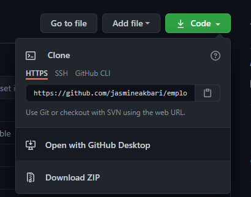
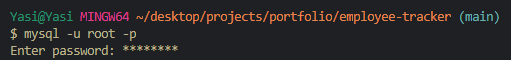
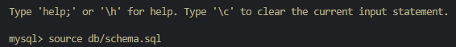
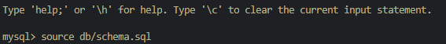
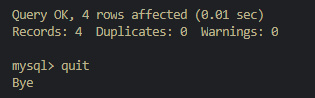
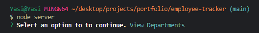

# employee-tracker

## Description

This is an employee tracking application using solely the command line. Following the prompts you can view current employees, existing roles and departments as well as update an employees information.

## Table of Contents

* [Video]
* [Usage]
* [Contributions]

## Links
Please see the walkthrough video of application in action for your reference. [Walk-ThroughVideo](https://drive.google.com/file/d/1nmRiOLOFLytH3yOc5NMrdPoeHlYpHfz6/view)

## Usage

Here are some helpful images to get you through to start using the tracker. Make sure you have node.js, mysql and inquirer available for use download packages as necessary:

1. Clone the repository to your machine. 

2. Sign in to mysql by type "mysql -u root -p" the password is: password.

3. Type "source db/schema.sql" to create the table.

4. Type "source db/seeds.sql" to populate information to the table.

5. Type "quit" to exit mysql prompts.

6. Type "node server" in order to initiate employee tracker prompts.

## Contributions

Created by: [GitHub]/jasmineakbari Feel free to contact me at: jasmineakbari@yahoo.com, if you have any questions regarding this project.